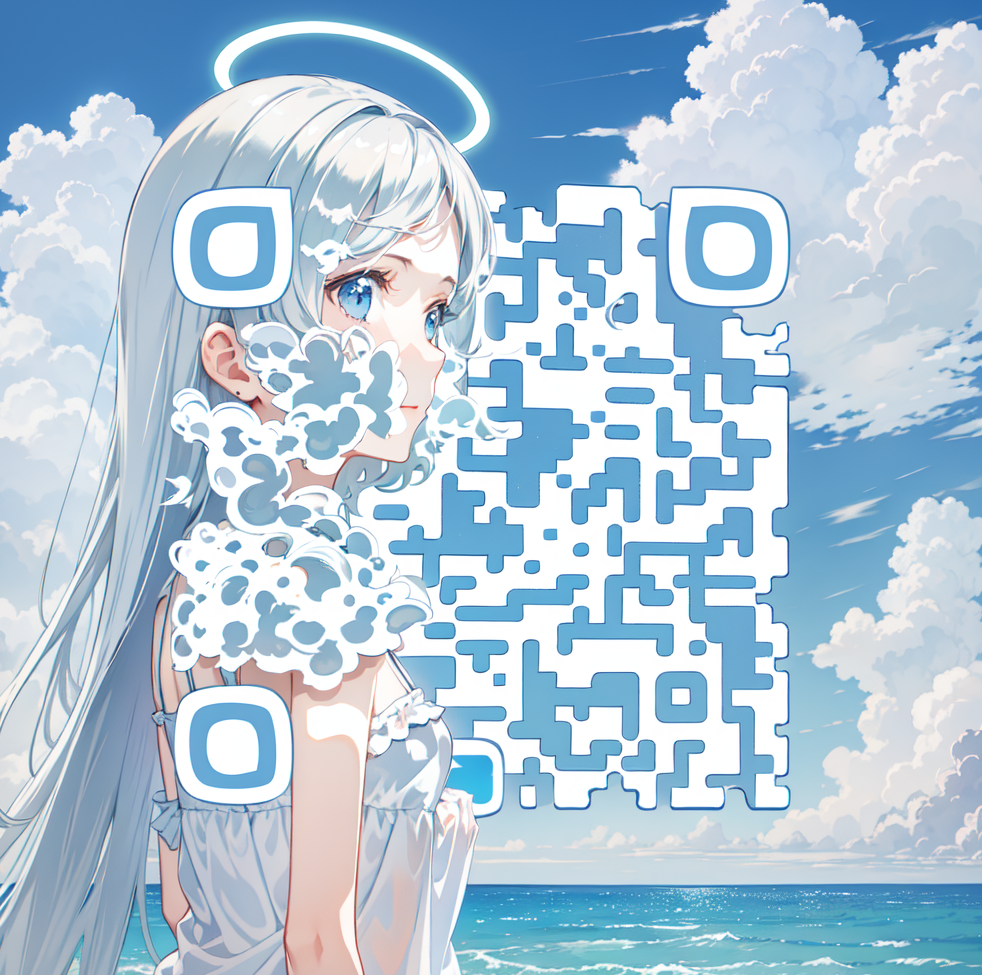
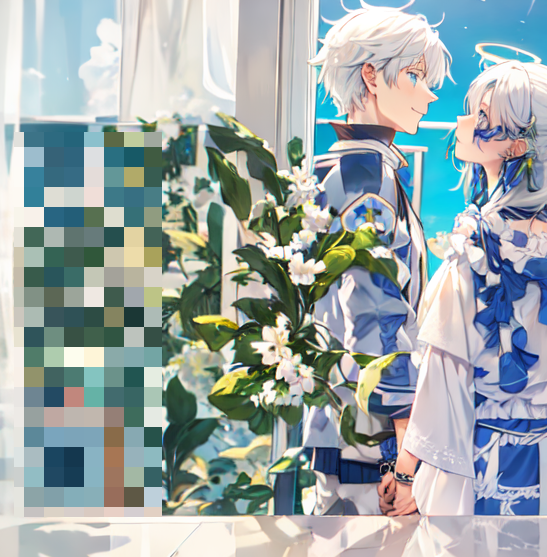

Most SD QR code generation methods can only produce one QR code. When dealing with couples, it becomes challenging to manage multiple elements within a complex graph and generate individual characters on QR codes separately.Most SD QR code generation method can only generate 1 QR code. When it comes to couples, it is too difficult to control multiple elements in a large graph and genrate seperate characters on QR codes. I find out way to conquer this problem and here are the samples.

My Wechat:

My Blog:

(When I had a girlfriend ... I use this group QR Code ....)

(This is a sad story, as I broke up after I finished this project... That's why this project is not open-sourced. I deleted most parts of the code. But if you are interested in this project, I could help you reproduce my work.)